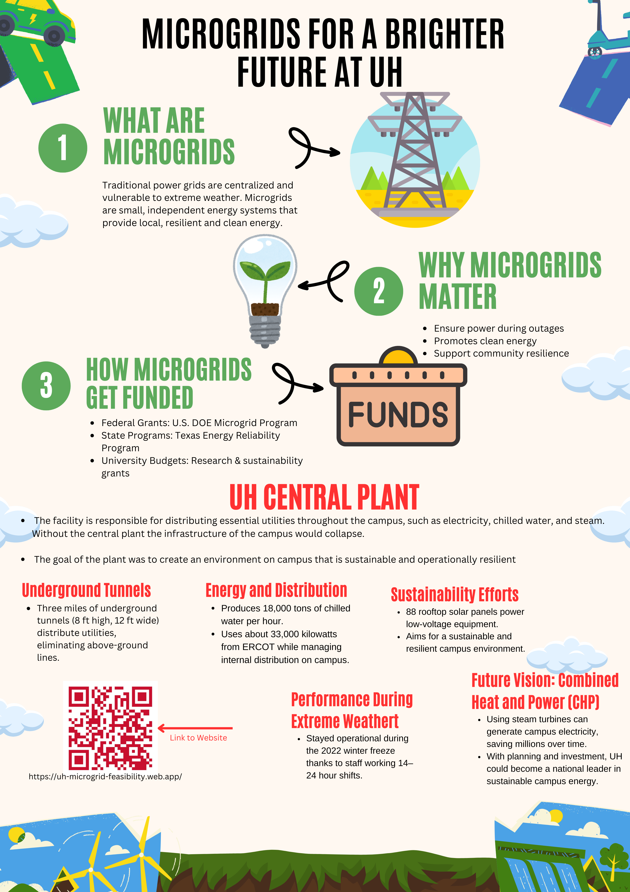

# uh_microgrid_feasibility
Class group project centered around exploring the feasibility of funding and developing a microgrid at the University of Houston.

<!-- Add Poster Image -->


## Prerequisites

*   [Node.js](https://nodejs.org/) and npm (Node Package Manager)
*   [Firebase CLI](https://firebase.google.com/docs/cli#setup_update_cli): `npm install -g firebase-tools`
*   A Firebase account and an existing Firebase project.

## Setup

1.  **Clone the repository:**
    ```bash
    git clone <your-repo-url>
    ```
2.  **Navigate to the project directory:**
    ```bash
    cd class_project
    ```
3.  **Install dependencies:**
    ```bash
    npm install
    ```
4.  **Log in to Firebase:**
    ```bash
    firebase login
    ```
5.  **Link to your Firebase project** (if you haven't associated this local directory with a Firebase project yet):
    ```bash
    firebase use --add
    ```
    Follow the prompts to select your Firebase project.

## Running Locally

1.  **Start the local Node.js server:**
    ```bash
    node app.js
    ```
2.  Open your web browser and navigate to `http://localhost:3000`.

## Deployment

This project is configured for Firebase Hosting.

*   **Manual Deployment:**
    ```bash
    firebase deploy
    ```
*   **Automatic Deployment (GitHub Actions):** If you configured the GitHub Action during `firebase init`, pushes to the main branch will automatically trigger a deployment.
