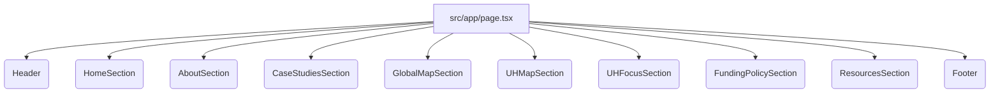

# Codebase Migration Plan to Next.js with Tailwind CSS

This document outlines the plan to migrate the existing single-page website codebase (from the parent directory) into the new Next.js project located in the `tailwind_dashboard` directory.

**Existing Codebase Overview:**

The existing project consists of:
- `index.html`: A single HTML file with the page structure and content.
- `style.css`: Custom CSS for styling and responsiveness.
- `script.js`: JavaScript for interactive elements (mobile menu, scroll animations).
- `images/`: Directory containing images used in the site.

**Target Project:**

The target is a new Next.js project with Tailwind CSS set up in the `tailwind_dashboard` directory.

**Migration Steps:**

1.  **Migrate Static Assets:**
    *   Copy the `images` directory from the parent project root (`./images`) into the `public` directory of the Next.js project (`./tailwind_dashboard/public`). This makes the images accessible within the Next.js application using paths like `/images/...`.

2.  **Convert HTML Structure to React Components:**
    *   Break down the `index.html` file into smaller, reusable React components.
    *   Create a main page component (`./tailwind_dashboard/src/app/page.tsx`) that will serve as the main layout for your single page.
    *   Create separate components for the header, footer, and each major section (e.g., `Header.tsx`, `Footer.tsx`, `HomeSection.tsx`, `AboutSection.tsx`, `CaseStudiesSection.tsx`, etc.) within the `./tailwind_dashboard/src/components` directory.
    *   Assemble these components within `./tailwind_dashboard/src/app/page.tsx` to recreate the overall page structure.

3.  **Migrate CSS to Tailwind CSS:**
    *   Analyze the CSS rules in the original `style.css`.
    *   For each element in your new React components, replace the existing CSS classes with appropriate Tailwind CSS utility classes directly in the `className` attribute.
    *   For any complex or custom styles that cannot be easily replicated with Tailwind utilities, add them to the global CSS file (`./tailwind_dashboard/src/app/globals.css`) or consider using CSS Modules if specific to a component.
    *   Remove the link to the original `style.css` file from the main layout component (which will be replaced by the Next.js structure).

4.  **Adapt JavaScript Functionality to React:**
    *   Reimplement the mobile menu toggle logic using React state and event handlers within the `Header` component.
    *   Adapt the header hide/show on scroll functionality using React's `useEffect` hook and event listeners, likely within the `Header` component.
    *   Recreate the section fade-in animation using `IntersectionObserver` within the individual section components or a custom React hook, triggered by `useEffect` when the component enters the viewport.
    *   Ensure smooth scrolling for internal navigation links is handled correctly within the Next.js environment (potentially using Next.js's `Link` component and handling the scroll behavior).

5.  **Refine and Test:**
    *   Build the Next.js project (`npm run build`) to check for compilation errors.
    *   Run the development server (`npm run dev`) to preview the migrated site.
    *   Thoroughly test all sections, navigation links, responsiveness, and interactive elements to ensure they function as expected and the styling is correct.
    *   Address any issues that arise during testing.

**Component Structure:**

This plan provides a roadmap for migrating your existing codebase into the new Next.js project with Tailwind CSS.